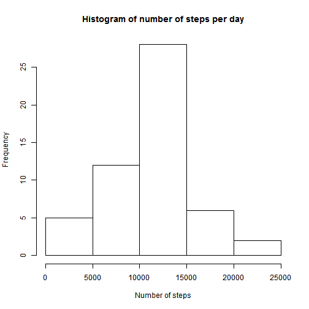
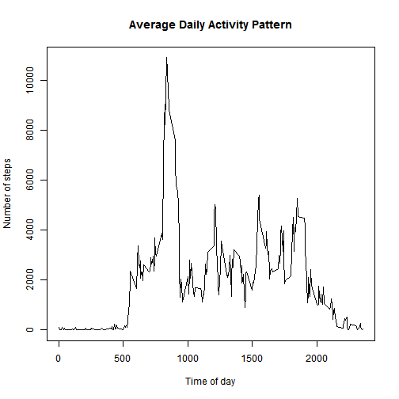
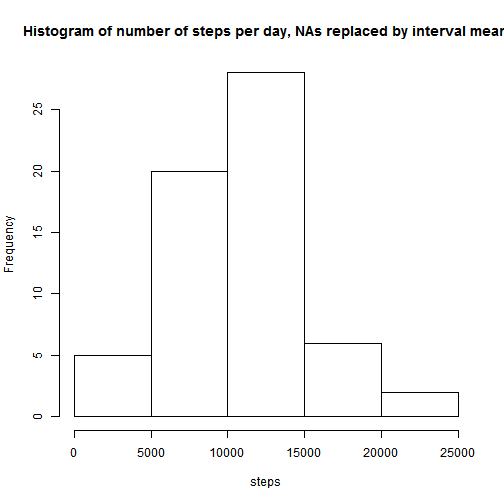
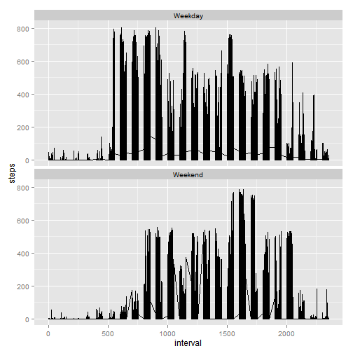

## Loading and preprocessing the data

```r
data <- read.table("C://Users//Cormac//Documents//R//activity.csv", header = TRUE, sep = ",")
daysum <- aggregate(steps ~ date, data, sum)
```


## What is mean total number of steps taken per day?

```r
hist(daysum$steps, main="Histogram of number of steps per day", xlab="Number of steps")
```

 

```r
meansteps <- mean(daysum$steps)
mediansteps <- median(daysum$steps)
```

The mean number of steps is 1.0766189 &times; 10<sup>4</sup> and the median number of steps is 10765


## What is the average daily activity pattern?

```r
timesum <- aggregate(steps ~ interval, data, sum)
plot(timesum, type="l", main="Average Daily Activity Pattern", xlab="Time of day", ylab="Number of steps")
```

 

```r
rowMax <- which.max(timesum$steps)
timeMax <- timesum[rowMax, 1]
timeMax <- sub("(\\d+)(\\d{2})", "\\1:\\2", timeMax)
```

The maximum no of steps was recorded at time interval beginning at 8:35


## Imputing missing values

```r
sum(is.na(data$steps))
```

```
## [1] 2304
```

```r
library("data.table")
```

```
## Warning: package 'data.table' was built under R version 3.1.2
```

```
## data.table 1.9.4  For help type: ?data.table
## *** NB: by=.EACHI is now explicit. See README to restore previous behaviour.
```

```r
datat <- as.data.table(data)
datat$stepsNoNA <- datat$steps
datat$stepsNoNA[is.na(datat$stepsNoNA)] <- 0
datat <- datat[, meanSteps := mean(stepsNoNA), by=interval]
datat$steps[is.na(datat$steps)] <- datat$meanSteps[is.na(datat$steps)]
newdaysum <- aggregate(steps ~ date, datat, sum)
hist(newdaysum$steps , main="Histogram of number of steps per day, NAs replaced by interval mean", xlab="steps")
```

 

```r
newmeansteps <- mean(newdaysum$steps)
newmediansteps <- median(newdaysum$steps)
```

Missing values imputed by replacing them by the mean for that time interval over all days
The mean number of steps is 1.0581014 &times; 10<sup>4</sup> and the median number of steps is 1.0395 &times; 10<sup>4</sup>


## Are there differences in activity patterns between weekdays and weekends?

```r
datat$weekday <- weekdays(as.Date(datat$date))
datat$isWeekend <- datat$weekday %in% c('Saturday','Sunday')
datat$dayFactor <- factor(datat$isWeekend , labels =  c('Weekday','Weekend'))
library("ggplot2")
```

```
## Warning: package 'ggplot2' was built under R version 3.1.2
```

```r
p <- ggplot(datat, aes(interval, steps)) + geom_line()
p + facet_wrap( ~ dayFactor, ncol =1 )
```

 
